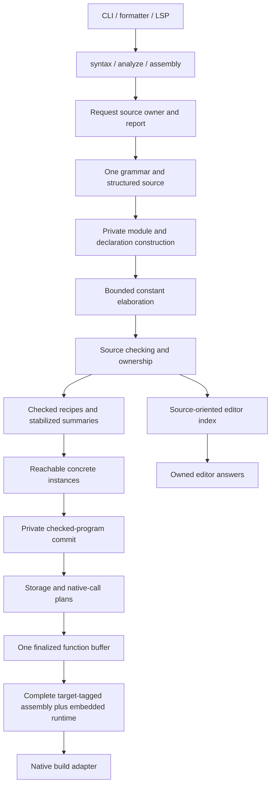

# Compiler Capsule executable blueprint

Status: draft for [Validate the compiler simplification blueprint](https://github.com/frendsick/casa/issues/651).
Final blueprint acceptance remains pending. The maintainer now targets roughly
10 seconds for self-compilation and prioritizes time over memory, while avoiding
multi-gigabyte memory use. See the [performance investigation](PERFORMANCE.md).
This directory is a throwaway prototype. It must stay on its evidence branch.
Production implementation remains outside the [compiler map](https://github.com/frendsick/casa/issues/638).

## Decision being tested

Can one request owner turn structured source into a checked semantic program,
project an independent editor snapshot, and emit executable x86-64 through one
function buffer, without passing a mutable declaration store between consumers?

The experiment uses Python's standard library and the existing Linux native
tools. Parsing, source checking, specialization, planning, and assembly generation
run in the candidate itself. It does not call the production compiler for these
operations. A separately built current compiler supplies the control results.
The fixed runtime is copied from that compiler's generated assembly.

Read the [captured measurements](MEASUREMENTS.md), inspect the
[raw samples](evidence.json), or open the [interactive evidence](evidence.html).

Run from the worktree root:

```sh
./install.sh
./casac -L lib casa.casa -o /tmp/casa-651-control
python3 compiler/blueprint_prototype/run.py --control /tmp/casa-651-control
```

The last command writes native artifacts, an installed executable archive,
`evidence.json`, and an interactive `evidence.html` under `/tmp/casa-651-evidence`.
It checks the three fixture outputs before measurement. The additional generated
generic-heavy workload is compiled but not executed. Each workload receives one
warm-up and three alternating control/candidate measurement pairs.
To compile a single source:

```sh
python3 compiler/blueprint_prototype/capsule.py \
  compiler/blueprint_prototype/common.casa --keep-asm -o /tmp/capsule-example
/tmp/capsule-example
```

The executable archive needs Python. It demonstrates packaged runtime
availability outside the checkout, not a self-hosted standalone release binary.

## Integrated design

The accepted contracts below describe the current design. The new compile-time
target permits investigating further simplifications and feature cuts. Any
specific language change still needs an explicit decision before implementation.

| Concern | Accepted contract |
| --- | --- |
| Capsule and typed products | [ADR-0166](../../docs/adr/0166-compiler-capsule-owns-phase-state.md), [ADR-0167](../../docs/adr/0167-compiler-products-own-independent-snapshots.md) |
| Grammar, source ownership, module identities | [ADR-0174](../../docs/adr/0174-front-end-parses-source-before-module-resolution.md) |
| Qualified imports and root-owned runtime state | [ADR-0168](../../docs/adr/0168-imports-expose-qualified-names-only.md), [ADR-0165](../../docs/adr/0165-runtime-state-is-owned-by-the-root-body.md) |
| Constants | [ADR-0171](../../docs/adr/0171-constants-use-bounded-target-independent-expressions.md) |
| Checking, recipes, summaries, specialization | [ADR-0173](../../docs/adr/0173-semantic-checking-owns-source-obligations.md), [ADR-0170](../../docs/adr/0170-generics-specialize-after-symbolic-checking.md) |
| Derivation and defaults | [ADR-0163](../../docs/adr/0163-standard-trait-derivation-is-a-complete-implementation.md), [ADR-0164](../../docs/adr/0164-trait-default-methods-are-trait-owned-generic-bodies.md) |
| Ownership guarantees | [Choose Casa's ownership guarantees](https://github.com/frendsick/casa/issues/660) |
| Target plans, runtime, native build | [ADR-0169](../../docs/adr/0169-backend-plans-and-renders-one-function-at-a-time.md) |
| Tooling and recovery | [ADR-0172](../../docs/adr/0172-editor-products-retain-verified-source-facts.md) |
| Measurement and gates | [Choose compiler simplification targets](https://github.com/frendsick/casa/issues/663), [measurement protocol](../../docs/benchmarks/compiler-simplification-measurements.md) |



These are responsibilities, not a prescribed file for each box. Keep the three
typed entry operations and five editor queries as the external interface.
Sources and diagnostics are report-owned. Compiler passes, declaration tables,
recipes, loans, target plans, and machine buffers stay private.

Syntax owns root-only lossless tokens and usable grammar facts. It does not
resolve imports. Analysis owns exact used source text, ordered diagnostics,
verified occurrences, source identities, and query-specific missing coverage.
Assembly owns its report and complete target-tagged text. Native tools only
consume the latter. Analysis cannot be converted into backend input.

Production acquisition normalizes paths against the captured request base,
coalesces identical overrides, diagnoses conflicts, and reads selected sources
once. Module discovery follows parsed imports in source order. Complete headers
precede body checking. Constant elaboration follows dependency modules and
source order. Shared resolution interprets neutral `Name {}` syntax without
parsing it again. The detailed visibility and recovery rules are in ADR-0174.

The checker settles one operation decision and applies its stack, ownership,
dependency, and editor effects. It checks admitted generic bodies once, stabilizes
recursive callable/origin summaries, validates the full generic dependency graph,
and specializes reachable recipes. It attaches cleanup to exits and assignments.
Only complete concrete bodies and validated references pass the private commit.

Target planning establishes physical storage and ABI actions. A function builder
selects instructions, finalizes frames and labels, renders, then releases its
buffer. Request-local layout, ABI, symbol, and literal tables survive between
functions. Complete assembly is published only after all references validate.
Native process execution owns temporary files and reports write, launch, and
nonzero failures without terminating from inside the compiler module.

## Lifetimes and failures

| Owner | Retained state | Release point |
| --- | --- | --- |
| Source/report builder | Exact used bytes and ordered diagnostics | Transfers to the requested product or internal-failure report |
| Syntax and module builders | Structured syntax, identities, lookup, recovery coverage | After shared checking, or rejection |
| Checker | Typed stack, origins, loans, work states, recipes, summary constraints | After index projection or checked commit |
| Checked program | Concrete bodies and their paired declaration facts | After target emission, or target failure |
| Function builder | Instructions, slots, labels, frame and temporary obligations | After each function renders |
| Analysis snapshot | Report and source-only editor facts | When replacement/query borrowers release it |
| Editor answer | Owned presentation and snapshot-relative ranges | After protocol conversion or caller release |
| Assembly result | Report and, on success, target-tagged complete text | After build/reporting |

Source rejection preserves diagnostics and independently verified editor facts.
Target rejection preserves source context but publishes no assembly. A reportable
internal invariant failure preserves the accumulated report and phase, with no
unfinished index or program. Native build failure is a separate result. Process
termination and allocation exhaustion are not recoverable compiler failures.

The prototype measures old/new snapshot overlap and release. Queries only inspect
the projected index. Returned answers remain usable after the snapshot is dropped.
It does not implement workspace discovery, aggregation, rename validation, or
document-version policy. Those remain implementation obligations under ADR-0172.

## Executed coverage and limits

| Case | Executed evidence | Limit |
| --- | --- | --- |
| Scalar | Checked i64 arithmetic and overflow termination | No complete numeric tower or constant evaluator |
| Aggregate | Independent 16-byte array copy, mutation through an exclusive argument, and C aggregate arguments/results | i64 elements and integer-class native structs only. No SSE, small-width fields, or memory-class returns |
| Branch, loop, match | Continuing joins, loop back-edge checks, exhaustive bool match, early return | No break/continue, enum-pattern guards, or closure cases |
| Direct and generic call | Input-origin borrowed results, checked recipe substitution, repeated concrete-instance reuse | Borrowed generics only. Recursive summaries, changed-binding cycle rejection, bounds and trait dispatch are not implemented |
| Cleanup | LIFO hooks, explicit drop, path-dependent cleanup flags, early return | Flat word-field structs. Owned temporaries must be bound before borrowing/projection. Nested owners, ordinary Copy structs, malformed drop hooks and borrow-binding reassignment reject. No full loan analysis, disjoint field loans, closure captures, or cleanup-observed borrow summaries |
| Source rejection | Type, use-after-move, local escape, live borrowed result, branch mismatch, unsafe/native ownership | The source language is a deliberately small subset, not the full production rejection contract |
| Editor | Unaffected definition survives another failed body, missing facts stay unavailable, UTF-8 byte positions, owned query answer | Two point queries. No five-query completeness or malformed-module recovery claim |
| Private commit | Repeated specialization and rejected invalid seal, missing recipe, bad call reference | Python privacy is a module convention. It is not a static Casa type-safety proof |
| Target/build | Finalized checked return-stack frames, data-stack arguments/results, recursive overflow termination, retained complete assembly, aggregate C return, seventh integer argument, failed write/tool/build | Full ABI/storage combinations remain below |
| Distribution | Executable archive runs from another directory with no runtime asset next to it | Requires Python. Native standalone compiler distribution remains a final implementation gate |

The prototype uses owning pointers for ordinary struct values, inline local
storage for Copy arrays and extern structs, data-stack arguments/results, and
checked return-stack frames for Casa calls. Ordinary struct construction and
cleanup execute the copied allocator/free routines. These exercise the accepted
carrier and frame responsibilities for the represented types. They do not cover
the full physical type graph, every allocator edge, closure environments, or
complete ABI classification. The copied runtime also executes output, arithmetic
failure and recursive return-stack overflow paths.

Both compilers execute the same three fixture sources. Paired compilation also
uses identical sources, including the compile-only generic-heavy workload. Mutable
copy checks run inside a function. Current implicit root globals otherwise change
the behavior before the accepted root-execution migration. That difference is
excluded from the common-source workload rather than counted as an architecture gain.

## Invalid-state dispositions

| Baseline family | Production disposition | Slice evidence |
| --- | --- | --- |
| Source/internal name confusion | Preserve tokens, use separate identities | Original tokens and declaration IDs stay separate |
| Parser/module flags | Private construct-local builders and validated discovery | Grammar-local products only. Module recovery is not exercised |
| Phase-polymorphic operations | Source grammar plus one semantic vocabulary | Source nodes do not enter target lowering |
| Body/phase-flag mismatch | Work state owns transformation and atomic completion | Recipe table commits only completed checks |
| Mismatched operation/store pair | One immutable checked product | Commit checks call IDs and instance presence |
| Ownership-ID side table | Cleanup actions travel with bodies and exits | Specialized bodies retain attached cleanup |
| Error-bearing backend input | Separate partial analysis and private checked commit | Rejected source produces no assembly |
| Machine field/family mismatch | Private constructors and finalized function validation | Labels and frames are local. Full operand-family validation remains unimplemented |

## Implementation work breakdown

Implementation can use non-releasable intermediate commits on one implementation
branch. The following units have observable outcomes and one owner for each
deletion. They are not new wayfinder decisions and have not been published as
implementation tickets.

| Unit and dependency | Observable outcome | Remove when replaced | Retain or add through the new interface |
| --- | --- | --- | --- |
| 1. Request products and reports | Three typed operations retain exact source/error context and isolate two requests | Public `AnalysisResult.typechecked`, operation/store pairing, duplicated report ownership | `test_analysis.casa`, override conflicts, failure attribution and independent release |
| 2. Grammar, modules, constants. Needs 1 | One grammar supplies formatter and module discovery. Qualified lookup and bounded constants implement accepted source contracts | Token-prefix rewriting/reversal, repeated import parsing, selective-import closure and retention, global initializer schedules, `const fn` evaluation | Parser/module/constant fixtures, both `Name {}` forms, delimiter recovery, exact numeric edge and failure tests |
| 3. Semantic construction. Needs 2 | Every admitted source body has established operation, stack, ownership, origin, callable and cleanup facts | Clone/commit modes, encoded origins, function phase booleans, parallel ownership-ID records and repeated operation decisions | `test_owned_contexts.casa`, `test_destruction.casa`, branch/loop/match/closure and diagnostics cases |
| 4. Recipes and concrete commit. Needs 3 | One symbolic check, complete cycle validation and cached reachable instances feed a sealed program | Synthetic derived/default source bodies, repeated generic source checking, public specializable bodies and mismatched stores | `test_traits.casa`, `test_derived_conformances.casa`, unused-body checks, non-generic cycle intermediates, bounds, recursion, borrowed generic results |
| 5. Target planning and function emission. Needs 4 | One authoritative storage/native plan feeds completed function buffers | Public `Program`/`InstValue`, whole-program bytecode list, repeated family matching, source marker prepass, backend semantic/trait queries, renderer ABI allocation | Storage-plan tests, existing C fixtures, SSE/GPR exhaustion, spills, hidden results, normalization, frame restoration, invalid private references |
| 6. Runtime and native adapter. Needs 5 | Installed compiler contains fixed runtime and builds through one driver call with complete retained assembly | Runtime string-construction control flow, intermediate object management, helper-owned process exits | Allocator alignment/reuse/growth/zero/null/failure, output retry/error, return-stack exhaustion, libraries, missing tools, write failures, installed binary outside checkout |
| 7. Consumers and cutover. Needs 1 through 6 | CLI, LSP and formatter use typed products. Language docs/examples match accepted changes | Document-owned operations/function maps, query-time body clones, duplicate semantic interpretation, transitional wrappers | Five query availability contracts, workspace coverage/rename/freshness, formatter goldens/refusal/equivalence/idempotence, retained language/example suites |
| 8. Bootstrap and measured acceptance. Needs 7 | Stable-to-branch build, self-hosting, fixed point, behavior and agreed maintenance/performance gates pass | Old implementation and remaining compatibility scaffolding | Full 14-shard suite, stage-two/stage-three assembly equality, paired corpus, separate self-compilation, repeated editor workloads |

Within unit 2, record accepted behavior changes separately from architecture
restructuring wherever a working measured checkpoint permits. Do not maintain
two permanent semantic implementations merely to make attribution convenient.
Representation-only tests may disappear when their distinct observable contract
has equivalent coverage. Do not remove diagnostic, ownership, ABI, formatter, or
runtime behavior coverage to meet a line-count goal.

## Maintenance estimates and calibration

Current source still matches the pinned whole-compiler audit in the compiler,
tooling, test and library paths. The baseline is 40,192 compiler lines plus 3,920
direct-consumer lines. The historical non-overlapping deletion floor remains
820 to 850 production lines and 350 to 500 test lines. Approximately 500 compiler
lines were estimated as runtime relocation. These are not measured savings.

The 929-line selective-import module is not an additional 929-line saving. Its
350 to 380 obsolete lines already overlap the deletion floor. The remaining
opportunity overlaps global removal and grammar restructuring. Likewise, the
302 function-only constant-helper lines are gross candidates before the typed
replacement cost. Do not add these estimates together.

This slice measures the replacement cost of a restricted model. Its source count
cannot be extrapolated proportionally to a 40,192-line compiler. It omits the
hardest semantic cases and uses a different implementation language. It validates
that these exercised consumers can avoid shared mutable phase state. It does not
measure net production deletion or establish a production speed/memory gain.

Count the actual implementation against the baseline after removing obsolete
paths. Count relocated runtime text as maintained source. Report behavior-change
and architecture gains separately only from measured checkpoints, otherwise
report combined change with its attribution limit. Count caller concepts,
product/failure variants, valid pairings, ordering, lifetime rules, dependency
direction and duplicated semantic decisions alongside source lines.

For the selected interface, callers no longer coordinate parse/check/lower phase
order or pair operations with a store. They still know which product they request,
source-relative query positions, rejection versus internal/native failure, and
snapshot version/release rules. The slice exercises three entry operations and
two queries. The accepted production contract has five queries. The public
surface is not measured by callable count alone.

## Bootstrap and final gates

Use the configured stable v1.50.0 compiler to build the implementation while its
source remains in shared supported syntax. Current production sources already
use qualified imports and contain no executable `global` or `const fn`
declarations. Keep newly introduced language forms out of implementation source
until the newest stable compiler accepts them.

When valid repository source needs syntax that stable cannot compile, create the
next stable release and update `casa-release.env` before adopting that source.
This applies even if `casa.casa` still builds. Invalid fixtures and source snippets
inside strings are distinct. A prototype in Python does not establish this route.

The final branch compiler must compile itself. `tests/test_bootstrap.sh` must
produce identical stage-two and stage-three assembly. `tests/test_all.sh` must
build the branch compiler and pass all 14 shards. Release `casac` and `casafmt`
retain their exact asset names, with `casafmt` built by that release's `casac`.
Installation requirements must match the single C compiler driver used by the
new build adapter. Linux x86-64 is the acceptance target. Windows is deferred.

Performance validation follows the linked protocol. Pin compiler hashes,
provenance, machine, tools, flags, libraries, source corpus and output mode.
Measure each compiler's own source separately from identical common-source
workloads. Do not compare the Python slice's self-compilation with Casa's.

The maintainer rejected the proposed regression ceilings and set a roughly
10-second self-compilation goal. Memory is secondary unless it reaches multiple
gigabytes. The exact acceptance band and memory guardrail remain unspecified.
The integrated Python slice does not establish a route to that speed target.
Final acceptance needs measured support for the performance plan and a decision
on the unexercised contracts. Full compiler correctness, self-hosting and
fixed-point evidence belongs to implementation.
